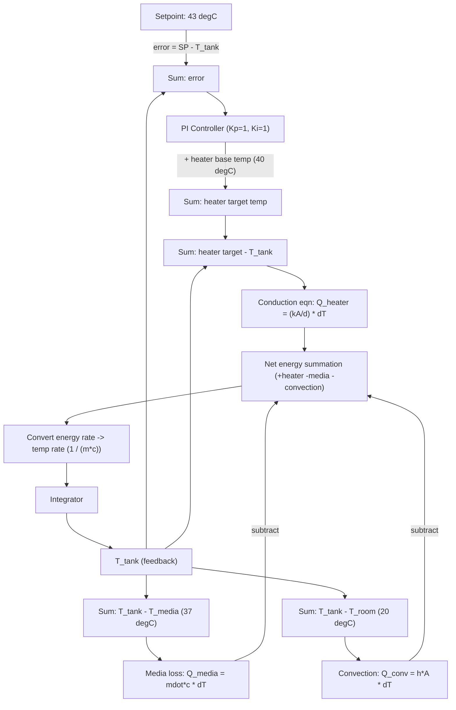

# Bioreactor Temperature Control — Simulink Model

This project is a Simulink model (`BioreactorTempTrialREADY.slx`) of the thermal
dynamics of a bioreactor tank, with a closed-loop PI controller regulating tank
temperature at a setpoint of **43 °C** by driving an immersion heater.

The model is a first-principles energy balance: every source and sink of heat
in the tank (heater, media exchange, convective loss to the room) is summed to
get the net rate of energy change, which is integrated into an actual tank
temperature. That temperature is fed back and compared to the setpoint to
close the loop.


## How it works

This bioreactor works by measuring the net energy gain from factors such as
the energy from the exchange of media, energy from the heater, and energy
lost due to convection. This is done via a summation block, which directly
computes the losses and gains in energy at any given time. This rate of
energy change is converted into the rate of temperature change using the
specific heat capacity of water, which is a plausible estimate for the
specific heat of the media. This is then input into the integrator block,
which converts the rate of temperature change into the actual temperature of
the tank at any given time. The actual temperature of the tank is subtracted
from the target temperature of 43 degrees.

This error is then input into the PI controller, which uses two different
terms, the proportional and integral terms. The proportional term directly
multiplies the error by a constant to become the proportional term of the
output; this is designed for more immediate responses to temperature
changes. Then, the integral term computes the time integral of the error and
multiplies that to be the integral part of the output. This term is
responsible for maintaining a steady state and ensuring that the system is
always working to maintain said steady state. The heater then takes the
input from the PI and adds it to the heater's initial temperature.

Following this step, the tank's actual temperature is subtracted from the
value representing the temperature change required to heat the system the
appropriate amount. Then this value is input into the conduction equation to
find the total amount of energy input from the heater. An additional value
included in the rate of energy summation block is the media exchange block,
which subtracts the temperature of the tank from the temperature of the
media. This difference in temperature is converted into an energy loss via
the specific heat capacity of water, which is then input into the energy
change summation block.

To show the heat loss due to convection, the room temperature is subtracted
from the temperature of the tank. This temperature difference is then input
into the equation for energy due to convection. This energy change is then
also input into the summation block as a subtraction, as this is the energy
that is lost due to the difference between the tank and room temperature.

## Signal flow



## Simulink model diagram

<!--
Add a screenshot of the Simulink block diagram here, e.g.:

Save the image as docs/simulink_model.png (create the docs/ folder if needed).
-->

## Model structure

| Block (as named in the .slx) | Type | Role |
|---|---|---|
| `Constant` (= 43) | Constant | Target/setpoint tank temperature |
| `Subtract` | Sum | Computes control error = setpoint − T_tank |
| `PID Controller` | PID block, configured as **PI** (P = 1, I = 1, D = 0) | Generates the correction output from the error |
| `Tank Heater` | Subsystem | Adds the PI output to the heater's base temperature (constant, 40 °C), subtracts T_tank, and applies the conduction equation `Q = (kA/d) * ΔT` (kA/d = 30) to get heater power |
| `Fresh Media Exchange (37 degs)` | Subsystem | Models the energy lost/gained by exchanging tank contents with fresh media at 37 °C: `Q = mdot·c · (T_tank − T_media)`, gated by a `Start of Media Infusion` step so it only activates once infusion begins |
| `Energy Loss from Convection` | Subsystem | Convective loss to the room (20 °C): `Q = h·A · (T_tank − T_room)`, with h·A = 5 |
| `Minus` | Sum | Net energy summation block — heater input minus media loss minus convective loss |
| `CONV: Rate of Change in Tank Energy` | Subsystem | Converts net energy rate to a temperature rate using the tank's thermal mass, `1 / (m·c)` with m = 240 kg and c = 4.184 kJ/kg·°C, plus unit conversions (kJ→J, min→s) |
| `Integrator` | Integrator | Integrates the temperature rate to produce the actual tank temperature, T_tank |
| `Transport Delay` | Transport Delay | Feedback path delay from T_tank back to the error/comparison blocks |
| `CONV: Heater Power to Current` | Subsystem | Converts heater power into the current draw shown on the `Heater Curret (Amps)` scope |
| `Scope T_tank`, `T_heater (degC)`, `Heater Curret (Amps)`, `Scope Media Energy` | Scopes | Live plots of tank temperature, heater temperature, heater current, and media exchange energy |
| `To Workspace`, `To Workspace1`, `To Workspace2` | To Workspace | Log simulation signals to the MATLAB workspace for post-processing |

## The control system

The temperature loop is a classic **PI (Proportional–Integral) controller**
acting on the error signal `e(t) = T_setpoint − T_tank(t)`:

```
u(t) = Kp * e(t) + Ki * ∫e(t) dt
```

with `Kp = 1` and `Ki = 1` in this model (the derivative term is present in
the block but set to `D = 0`, i.e. this is deliberately a PI, not a full PID,
controller).

- **Proportional term (`Kp * e`)** reacts instantly to the current
  temperature error. A large error (e.g. right after startup, or after a
  batch of cold media is infused) produces a large immediate correction,
  giving the loop its speed of response.
- **Integral term (`Ki * ∫e dt`)** accumulates error over time. A pure
  proportional controller always settles with some residual (steady-state)
  error, because as the error shrinks so does the proportional correction —
  eventually the heater output stops changing while the tank is still
  slightly off the setpoint. The integral term keeps growing as long as any
  error persists, so it continues pushing the heater output until the error
  is driven to zero. This is what lets the tank actually settle at 43 °C
  rather than just near it.
- **No derivative term**: with heater dynamics and media infusion events that
  are inherently noisy/discontinuous (the media exchange is gated by a step
  input), a derivative term would amplify that noise into the control
  signal, so it's omitted here in favor of a simpler, more robust PI loop.

The controller's output isn't applied to the heater directly as a power
value — it's added to the heater's base temperature (40 °C) to produce a
*target heater temperature*. The difference between that target and the
actual tank temperature is then run through the conduction equation
`Q = (kA/d) * ΔT` to get the actual heat flow into the tank. This mirrors a
real immersion heater: the controller effectively decides how hot the
element should run, and the physical conduction law (not the controller)
determines how much energy actually transfers into the tank.

Everything downstream of the controller is open-loop physics: media-exchange
losses/gains and convective losses are disturbances acting on the same
energy balance, and the PI loop's job is to keep compensating for them so
that the net energy summation — once integrated — holds T_tank at 43 °C.

## Testing & tuning

The PI controller was tuned experimentally by sweeping `Kp` and `Ki` and
running the model to check whether the tank settles at the 43 °C setpoint
within acceptable bounds. For each trial the following were recorded: peak
heater current, peak heater temperature, the remaining temperature error
after 30 minutes of simulated run time, and the minimum heater temperature
reached. A trial was marked **Pass** once the 30-minute error was
consistently small (sub-0.001 °C) and stayed that way, rather than just
happening to be near zero at the 30-minute mark.

| Trial | Kp | Ki | Max Current (A) | Max Heater Temp (°C) | 30-min Error (°C) | Min Heater Temp (°C) | Result |
|---|---|---|---|---|---|---|---|
| 1 | 1 | 1 | 13.874 | 109.59 | 0.46336 | 38.239 | Fail |
| 2 | 2 | 10 | 13.874 | 109.59 | 8.24E-11 | 39.173 | Fail |
| 3 | 15 | 2 | 13.874 | 109.59 | 0.24911 | 40.681 | Fail |
| 4 | 25 | 1 | 13.873 | 109.59 | 0.75888 | 40.994 | Fail |
| 5 | 10 | 5 | 13.874 | 109.59 | 0.0025861 | 40.26 | Fail |
| 6 | 8 | 10 | 13.874 | 109.59 | 3.57E-07 | 40.127 | Fail |
| 7 | 12 | 8 | 13.874 | 109.59 | 8.31E-05 | 40.508 | Fail |
| 8 | 15 | 10 | 13.874 | 109.59 | 2.37E-05 | 40.77 | Fail |
| 9 | 19 | 10 | 13.874 | 109.59 | 9.91E-05 | 41.005 | Pass |
| 10 | 20 | 10 | 13.874 | 109.59 | 0.00013306 | 41.063 | Pass |

Max current and max heater temperature stay essentially constant across
trials because they're driven by the initial startup transient (the biggest
error the loop ever sees), not by the gains. What the gains actually control
is how tightly the loop converges and holds the setpoint: low `Ki` trials
(1–5) leave a persistent steady-state error, and it's only once `Ki` is
raised to 10 alongside a sufficiently large `Kp` (≥ 19) that the minimum
heater temperature stays high enough, and the 30-minute error stays low
enough, for the trial to pass. Trials 9 and 10 (`Kp = 19–20`, `Ki = 10`) were
the passing configurations; the model as shipped in this repo defaults to
`Kp = 1`, `Ki = 1` (Trial 1), so the gains should be updated in the `PID
Controller` block if reusing these tuned values.

## Running the model

1. Open `BioreactorTempTrialREADY.slx` in MATLAB/Simulink.
2. Run the simulation (`Ctrl+T` or the Run button).
3. View results on the `Scope T_tank`, `T_heater (degC)`, `Heater Curret
   (Amps)`, and `Scope Media Energy` scopes, or inspect the logged signals
   pushed to the MATLAB workspace by the `To Workspace` blocks.
4. Controller gains (`Kp`, `Ki`), the setpoint (`Constant` = 43), media
   temperature, room temperature, and the conduction/convection coefficients
   can all be tuned by editing the corresponding blocks/subsystems listed
   above.

## Files

- `BioreactorTempTrialREADY.slx` — the Simulink model.
